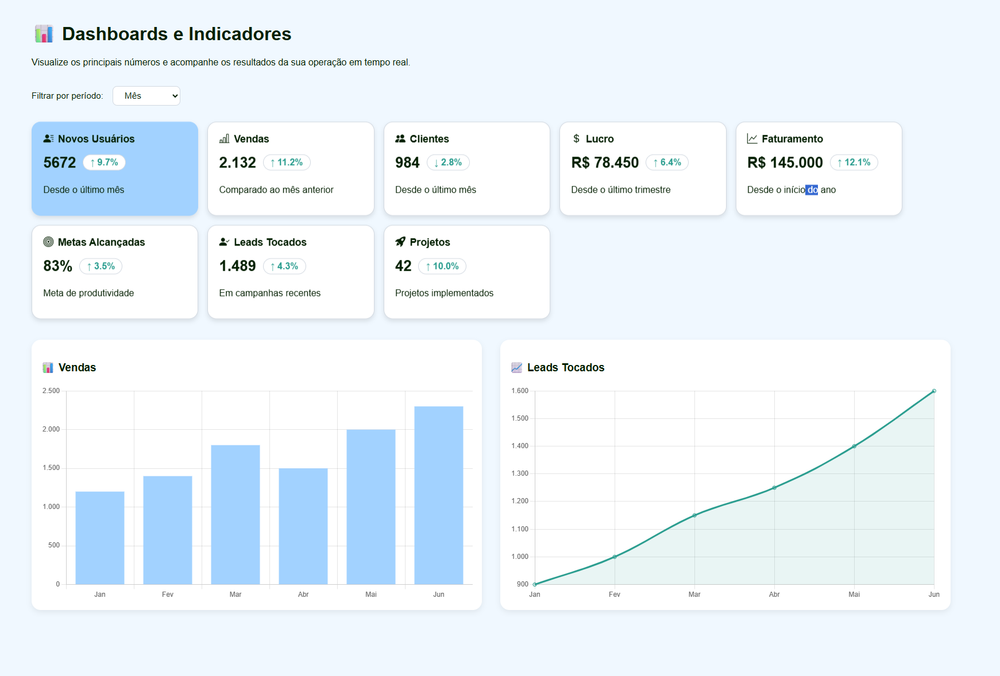

# 📊 Dashboard e Cards de Performance

## 📌 Sobre o Projeto

Dashboard interativo desenvolvido para apresentar indicadores chave de uma empresa com visual moderno e responsivo. O projeto exibe cards informativos com dados resumidos e um gráfico de linha e gráfico de colunas que apresenta o desempenho mensal ao longo dos últimos  06 meses.

---

## 🎯 Objetivos

- Apresentar indicadores empresariais relevantes em cards retangulares e estilizados.  
- Visualizar a evolução mensal dos dados com gráfico de linha e colunas.  
- Design responsivo para diferentes tamanhos de tela.

---

## 🧩 Funcionalidades

- 8 cards com indicadores empresariais (ex: Novos Usuários, Faturamento, Vendas, Clientes Ativos, Lucro, Leads Tocados).  
- Gráfico de linha com últimos 06 meses do ano.
- Gráfico de colunas com últimos 06 meses do ano.
- Layout organizado com títulos e subtítulos alinhados à esquerda.  
- Design minimalista e moderno com cores harmônicas.
---

## 🔍 Exemplos Visuais

  

---

## 📁 Estrutura do Projeto

dashboard-interativo/
├── index.html # Estrutura da página e cards
├── style.css # Estilos, layout, responsividade e modo escuro
├── script.js # Lógica JS para gráficos e interação
├── README.md # Documentação do projeto
├── examples/ # Exemplos visuais (imagens e gifs)

---

Sinta-se à vontade para colaborar, customizar ou contribuir!
Feito com 🧠 por [almeidasito7](https://github.com/almeidasito7)

