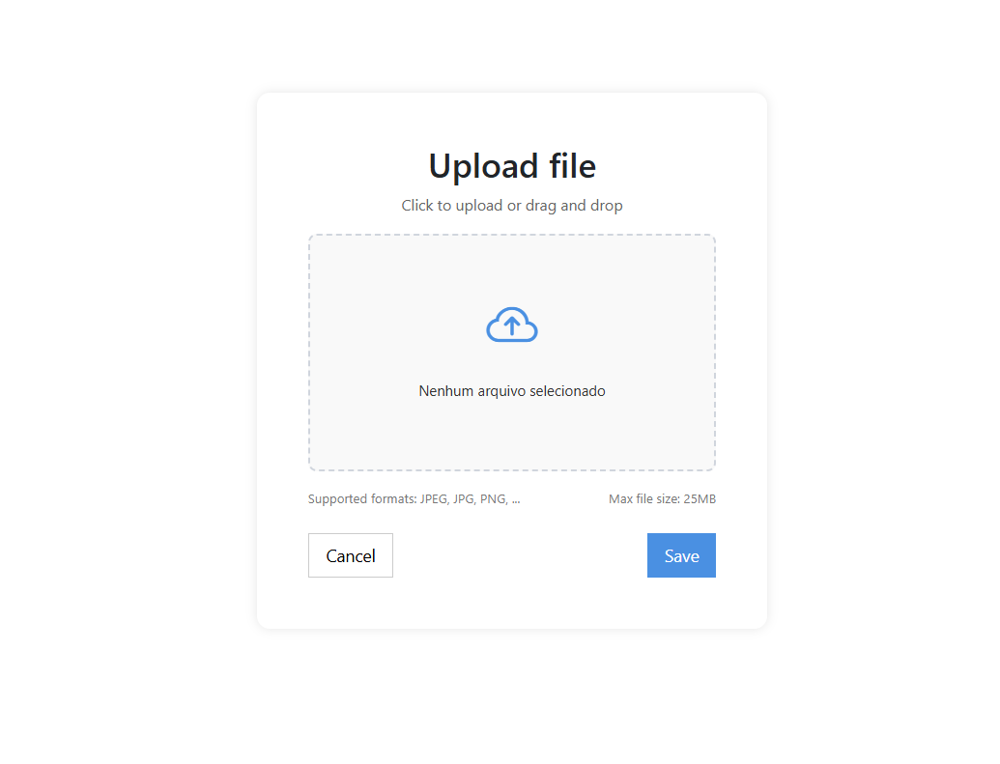

# 📁 Componente de Upload de Arquivos

## 📌 Sobre o Projeto

Componente moderno e responsivo para upload de arquivos, com suporte a clique ou arraste (drag & drop), mensagens visuais interativas (pop-ups) e validações nativas.

---

## 🎯 Objetivos

- Facilitar o upload de arquivos com feedback visual em tempo real.  
- Garantir acessibilidade e clareza no processo de envio.  
- Permitir validações como limite de tamanho e confirmação de envio/cancelamento.

---

## 🧩 Funcionalidades

- Área de upload com clique ou arraste e soltar (`drag & drop`).  
- Exibição do nome e tamanho do arquivo selecionado.  
- Pop-up de sucesso ao salvar arquivo.  
- Pop-up de erro se o arquivo for maior que 25MB.  
- Pop-up de alerta ao tentar salvar sem selecionar arquivo.  
- Pop-up de confirmação ao cancelar upload.  
- Estilização responsiva e intuitiva.  
- Ícones modernos do Bootstrap 5.

---

## 🔍 Exemplos Visuais

  

---

## 📁 Estrutura do Projeto

upload-file-component/  
├── index.html   # Estrutura da interface  
├── style.css    # Estilização do layout e pop-ups  
├── script.js    # Lógica completa com drag & drop e validações  
├── README.md    # Documentação do projeto  
├── examples/    # Imagens de exemplo (adicione aqui se desejar)

---

Sinta-se à vontade para usar, modificar ou contribuir!  
Feito com 💻 por [almeidasito7](https://github.com/almeidasito7)
