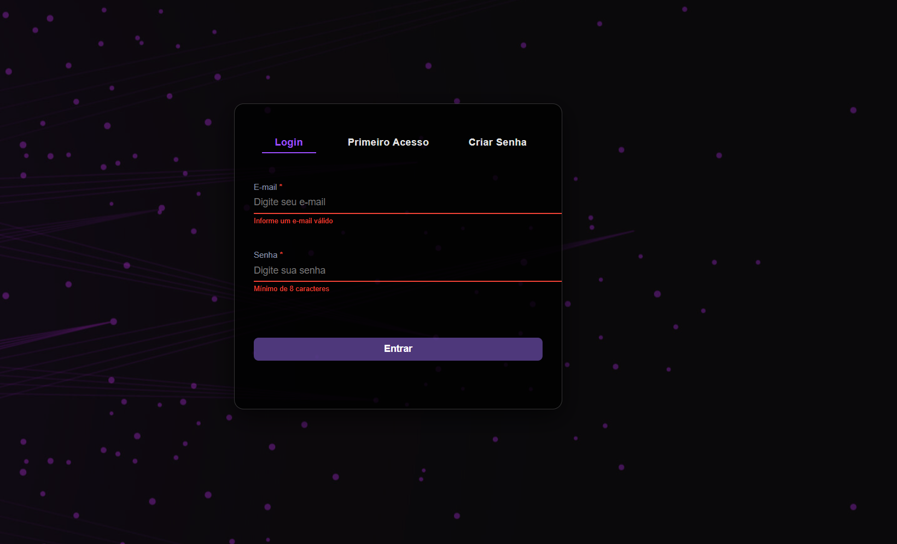
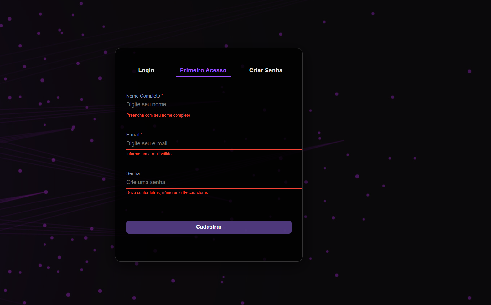
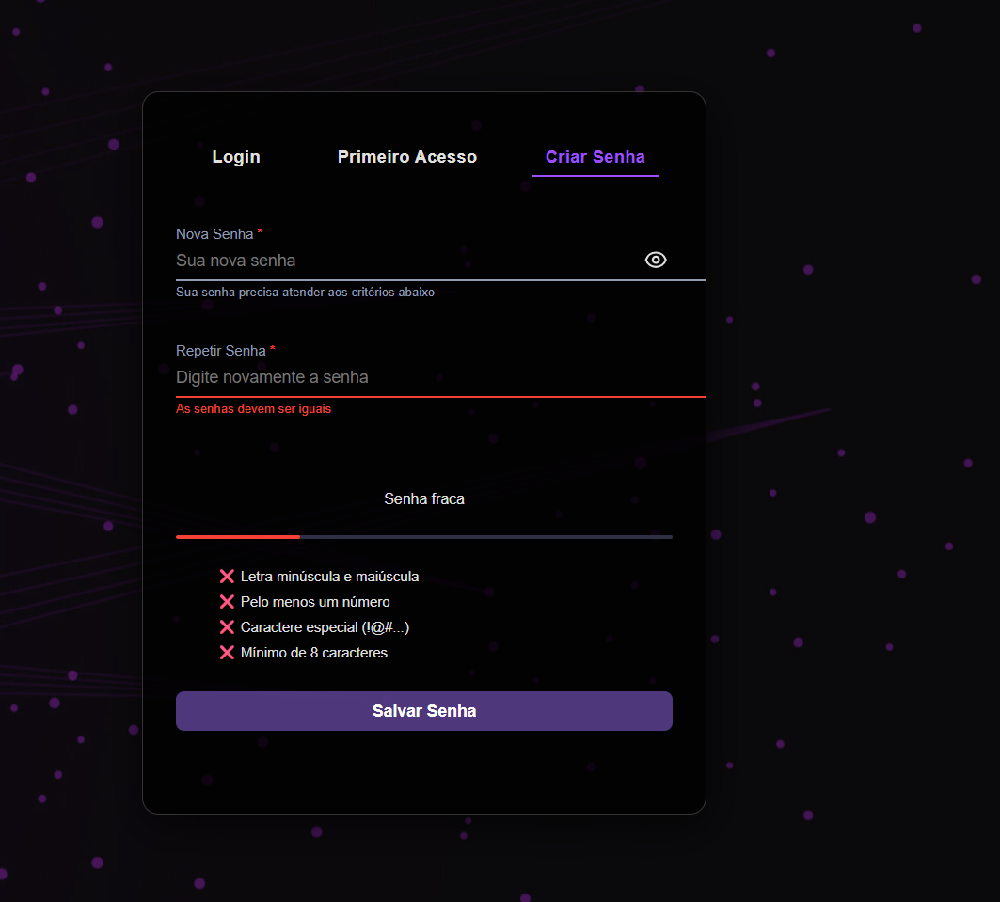

# Project-Password Checker

## Sobre o Projeto

O **Project-Password Checker** é um componente front-end que oferece três telas distintas — **Login**, **Primeiro Acesso** e **Criar Senha** — com validações de formulário, mensagens de erro inline e um medidor de força de senha em tempo real.

---

## Demonstração das Telas

### Tela de Login

<p align="center">
  
</p>

### Tela de Primeiro Acesso

<p align="center">
  
</p>

### Tela de Criar Senha

<p align="center">
  
</p>

---

## Estrutura de Pastas

```
Project-Password Checker/
├── assets/           # Recursos estáticos (fonts, ícones, etc.)
├── example/          # Imagens usadas no README e no componente
│   ├── login.png
│   ├── primeiro-acesso.png
│   └── criar-senha.png
├── index.html        # Documento HTML principal
├── style.css         # Estilos CSS
├── script.js         # Lógica JavaScript
└── README.md         # Este documento
```

---

## Tecnologias Utilizadas

* **HTML5**
* **CSS3** (Flexbox, CSS Variables)
* **JavaScript (ES6+)**

---

## Funcionalidades Principais

1. **Abas de Navegação**

   * Alterna entre as seções **Login**, **Primeiro Acesso** e **Criar Senha**.
2. **Validações de Formulário**

   * Campos obrigatórios (nome completo, e‑mail, senha).
   * Formato de e‑mail válido.
   * Confirmação de senha igual à senha criada.
3. **Indicador de Força de Senha**

   * Atualiza em tempo real baseado em critérios de complexidade:

     * Letra minúscula e maiúscula
     * Pelo menos um número
     * Caractere especial (ex: `!@#…`)
     * Mínimo de 8 caracteres
4. **Toggle de Visibilidade**

   * Ícone para mostrar/ocultar o conteúdo da senha.
5. **Mensagens de Erro Inline**

   * Feedback imediato abaixo dos campos quando a validação falha.

---

## Como Executar

1. Clone o repositório:

   ```bash
   git clone <url-do-repositorio>
   ```
2. Acesse a pasta do projeto:

   ```bash
   cd Project-Password\ Checker
   ```
3. Abra o arquivo `index.html` em seu navegador.

---

## Contribuindo

1. Faça um *fork* deste repositório.
2. Crie uma branch para sua feature:

   ```bash
   git checkout -b feature/nova-funcionalidade
   ```
3. Faça suas alterações e commite:

   ```bash
   git commit -m "Adicionando uma nova funcionalidade"
   ```
4. Envie para o repositório remoto:

   ```bash
   git push origin feature/nova-funcionalidade
   ```
5. Abra um Pull Request.

---

## Licença

Este projeto está licenciado sob a **MIT License**. Consulte o arquivo [LICENSE](LICENSE) para mais detalhes.
