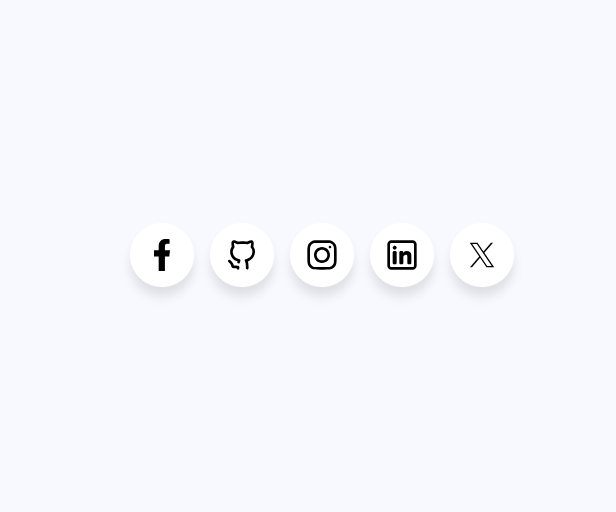
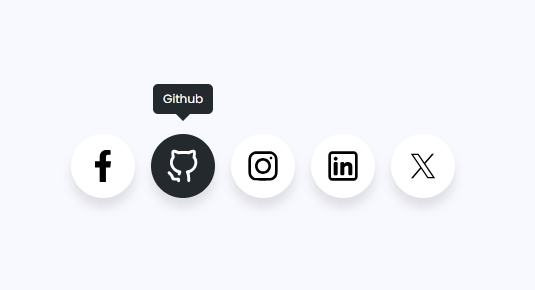
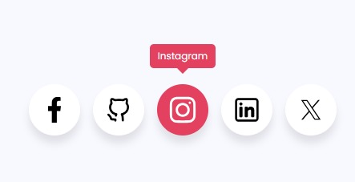
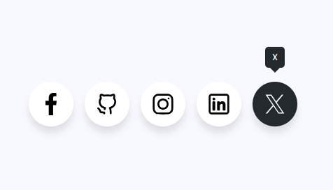

# Projeto: Ícones de Mídia Social com Hover

## 📌 O que é o Projeto

Este projeto consiste em uma interface limpa e responsiva que exibe ícones de mídias sociais com efeitos de **hover interativo** e **tooltip personalizada**, ideal para portfólios, landing pages ou aplicações web modernas.

---

## 🎯 Objetivo do Projeto

Criar um componente visual elegante que:
- Centralize os principais ícones sociais em um layout uniforme.
- Destaque o ícone com efeito ao passar o mouse (hover).
- Exiba o nome da rede social em uma tooltip.
- Sirva como base para reuso em projetos web diversos.

---

## 💬 Linguagens do Projeto

- `HTML5`
- `CSS3`

---

## 🔍 Exemplos Visuais

  

  

  

  

  

  

---

## 🛠️ Tecnologias Utilizadas

- **HTML5** – Estrutura dos elementos da página
- **CSS3** – Estilização, animações e responsividade
- **Font Google** e **SVGs personalizados** – Ícones sociais
- **Tooltip customizada em CSS**

---

## 🚀 Funcionalidades

- Ícones para as principais redes sociais:
  - Facebook
  - GitHub
  - Instagram
  - LinkedIn
  - X (antigo Twitter)
- Efeito `hover` com:
  - Mudança de fundo
  - Tooltip com nome da rede social
  - Destaque no ícone selecionado
- Design centralizado, moderno e responsivo

---

## 📁 Estrutura dos Arquivos

Project-Social-Media-Icons/
├── index.html
├── style.css
├── example/
│ ├── Social-Buttons-Ui-Example.png
│ └── Social-Buttons-Facebook.jpg
├── assets/
│ └── facebook.svg
├── README.md

---

Sinta-se à vontade para colaborar, customizar ou contribuir!  
Feito com 🧠 por [almeidasito7](https://github.com/almeidasito7)
